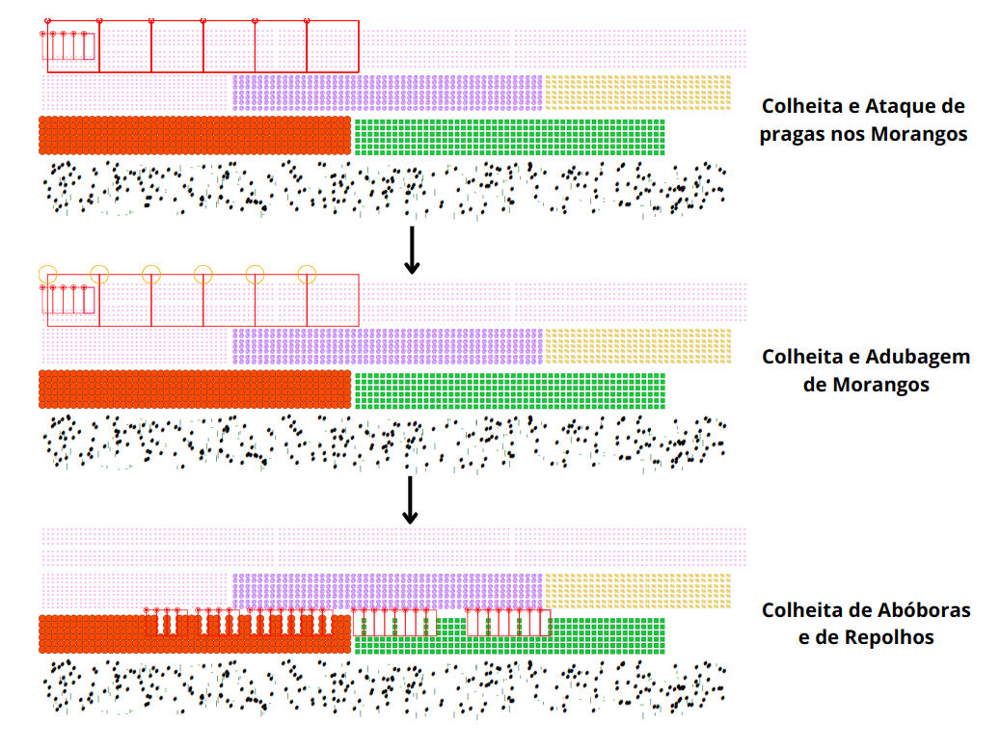

# 🌱🌾 Farm_Struct

<p align="center">
  
</p>


## Descrição

Este projeto é uma implementação de uma **fazenda virtual**, onde o cultivo e as colheitas são realizadas por meio de uma estrutura de dados baseada em uma **Árvore Radial**. O sistema permite realizar ações como colheita, ataque de pragas, cura de hortaliças, adubagem e semeadura. Além disso, ele gera relatórios sobre as atividades realizadas, incluindo os dados da figura e da colheita.

## Funcionalidades

- **Hortaliças:** O sistema suporta cultivo e colheita de várias hortaliças, incluindo:
  - Morango 🍓
  - Abóbora 🎃
  - Repolho 🥬
  - Cebola 🧅
  - Cenoura 🥕
  - Mato 🌿 (elemento indesejado)

- **Ações disponíveis:**
  - **Colheita:** Realiza a colheita das hortaliças dentro de uma área especificada.
  - **Ataque de Pragas:** Simula o ataque de pragas nas hortaliças.
  - **Cura de Hortaliças:** Recupera as hortaliças atacadas por pragas.
  - **Adubagem:** Aplica adubo nas hortaliças para melhorar o cultivo.
  - **Semeadura:** Plante novas hortaliças.
  - **Relatórios:** Geração de relatórios com dados das hortaliças e das colheitas realizadas.
  
 ---
  
# Árvore Radial 

A Árvore Radial é uma estrutura de dados hierárquica e espacial, onde cada nó é posicionado em um sistema de coordenadas 2D (com valores x e y). Ela é organizada de maneira circular, ou seja, em torno de um ponto central (a raiz). A ideia principal é dividir o espaço em setores, e os nós são distribuídos nesses setores de acordo com a sua posição espacial.

## Estrutura da RadialTree

A estrutura de dados **RadialTree** contém os seguintes atributos principais:

- **Raiz:** O nó inicial da árvore, que contém a origem da estrutura.
- **Fator de Degradação Atual (fatorDegAtual):** Representa o fator de degradação atual da árvore, que pode influenciar a organização e balanceamento da estrutura.
- **Fator de Degradação Máximo (fatorDegMaximo):** Limita o valor do fator de degradação para garantir que o valor fique controlado.
- **Total de Nós (totalNos):** O número total de nós presentes na árvore.
- **Total de Filhos (totalFilhos):** A quantidade máxima de filhos que cada nó pode ter.


## Resumo das Operações
- **Criação:** A árvore é criada com um número de setores e um fator de degradação.
- **Inserção:** Os nós são inseridos de acordo com a sua posição no plano 2D e são distribuídos entre os setores.
- **Percurso:** Você pode percorrer a árvore de maneira profunda (explorando filhos antes de irmãos) ou larga (explorando nível por nível).
- **Remoção:** Nós podem ser removidos, o que afeta o fator de degradação da árvore.
- **Cálculo do Fator de Degradação:** O fator de degradação ajuda a medir a eficácia da árvore, considerando a quantidade de nós removidos.


## Estrutura de Nó 
Cada **nó** na árvore contém as seguintes informações:

- **Posição (x, y):** Coordenadas espaciais que indicam a localização do nó.
- **Filhos:** Ponteiros para os filhos do nó, armazenados em um vetor.
- **Pai:** Ponteiro para o nó pai.
- **Item:** Contém a informação associada ao nó (geralmente um objeto ou dado de interesse).
- **Excluído:** Flag que indica se o nó foi removido ou não.
- **ID:** Identificador único do nó.

---

### **Instruções de Execução**  

1. **Clonar o repositório na sua máquina:**  
   ```bash
   git clone git@github.com:fonsecalarissamaria/Farm_Struct.git
   ```  

2. **Executar o script para extrair os arquivos e compilar:**  
   ```bash
   python3 et.py -Z -c -t
   ```  

   - O ZIP com os arquivos-fonte será extraído na pasta `alunos/larimsf/`.  
   - O Makefile será executado automaticamente.  
   - Os arquivos de saída serão gerados dentro de `alunos/larimsf/o/`.  

3. **Verificar as saídas dos testes:**  
   - Acesse a pasta de saída:  
     ```bash
     cd alunos/larimsf/o/
     ```  
   - Os arquivos gerados (SVG, TXT, relatório de saída) estarão disponíveis para análise.
